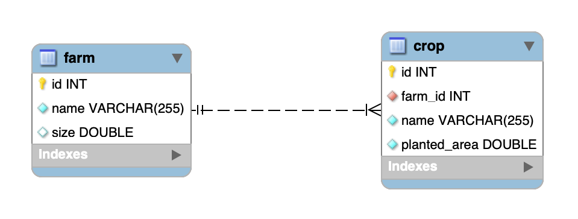

# `Farm-api`

# farm-api

<h3>

Nesse projeto é desenvolvido uma API rest em java
ultilizando o ecossistema spring, spring data Jpa para persistência no banco de dados
(banco de dados ultilizado MySql) e spring security com jwt para autentificação e autorização.

</h3>

🗄️ Descrição do banco de dados
 

Nesse modelos, temos as seguintes tabelas:

- `farm`: representa uma fazenda
- `crop`: representa uma plantação, e está em relacionamento `n:1` ("muitos para um") com a
  tabela `farm`
- `fertilizer`: representa um fertilizante, e está em um relacionamento `n:n` ("muitos para muitos")
  com a tabela `crop`. Esse relacionamento é realizado através da tabela `crop_fertilizer`.

## Maven

  
🖥️ Instalando as dependências do projeto
 

Para instalar as dependências do projeto, basta executar o comando `mvn install`.

  
🛠 Rodando os testes com o Maven
 

### Executando todos os testes

Para poder executar os testes, basta executar o comando `mvn test` para **todos** os testes serem
executados.

### Executando um teste específico

Para executar um teste expecífico, inicie sua aplicação com `mvn test -Dtest=”TestClassName”`,
utilizando o nome da classe de teste que deseja executar.

  
🎛 Rodando o linter (Checkstyle)
 

Usaremos o [Checkstyle](https://checkstyle.sourceforge.io/) para fazer a análise estática do seu
código.

Caso deseje rodar o `Checkstyle` manualmente em um projeto, basta executar o comando
`mvn checkstyle:check`.

